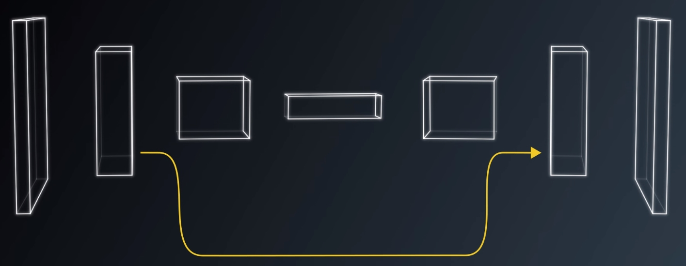

# Robotics Nanodegree #

# Term1 – Project4: Follow Me #

## INTRO ##

The purpose of this project is to implement a Fully Convolutional
Network (FCN) to identify a target person on a streaming video and
follow it using a drone. Concepts learned for project4 (including the
labs) were:

*Basic quadcopter flight dynamics

*PID controllers

*FCN: 1D convolutions, transposed convolutions, skip connections, batch
normalization

*Keras (as a higher level of TF for rapid prototyping of NNs)

## DATA COLLECTION ##

Part of the project was to collect the image data to train the FCN. It
is essential to devise a good strategy for this so that all types of
images are represented and with appropriate amounts. The basic idea was
to collect 4 types of images all over the Unity “world”:

-images following target (sometimes zig-zag to get different angles of
target)

-images of non-target people

-images of target inside groups of many non-target people

-images w/out target or non-target people

## FCN ##

FCNs classify and predict where the object is in the image as opposed to
CNNs that only classify the object. After the FCN is trained, the
weights on the encoder/decoder portion are frozen, and inference can be
used classify and find where in the image the object is. The encoder and
the decoder are the 2 basic blocks of the FCN, connected by a 1x1
convolution:

The basic characteristics of a FCN are:

-1x1 convolutions, can accept any si

-Transposed convolutions – upsample the previous layer to a desired
dimension. Also called “deconvolutions”

-Skip connections – allow to know where in the image the object is. They
feed the output of layers in the encoding block to layers in the decoder
block, using element wise operations. Allow for multiple resolutions.

The following image shows how skip connections enhance the FCN
predictions:

Batch normalization, normalizes the input to each layer. Due to this
extra computation, each pass takes longer to complete, but overall
convergence of the NN is faster.

If we wanted the drone to follow a different target shape, e.g. a dog,
or a robot, the FCN would have to be retrained to obtain a new set of
weights. However, the same architecture can be used.

## TRAINING PARAMETERS CHOSEN ##

learning\_rate = 0.002 (chosen high since using batch normalization)

batch\_size = 32 (to keep computer memory low)

num\_epochs = 50 ( after \~50 passes, no decrease in loss, so stop here
to avoid overfitting)

steps\_per\_epoch = \#train\_samples // batch\_size + 1

validation\_steps = \#valid\_samples // batch\_size +1

EVALUATION and SENSITIVITY to DATASET SIZE

The FCN was run using 2 data sets:

-dataset\#1 included images that I collected: 1209 for training and 698
for validation

-dataset\#2 included images that I collected PLUS images downloaded:
5327 for training and 1869 for validation

The model was run on Amazon’s EC2 p2.xlarge instance.

Evaluation of images following target person:

Evaluation of images patrolling w/out target person:

Evaluation of images patrolling with target:

Scores:

The FCN was able to obtain a final passing score &gt; 0.4. More data
able to improve accuracy of the model. The model is saved by creating an
.h5 file that contains all weights of the FCN.

## QUADCOPTER FOLLOW ME using INFERENCE ##

Using the frozen weights of the FCN, the Quadcopter can be controlled by
using the follower.py script.

A video showing the follow me is shown here.

## FUTURE ENHANCEMENTS ##

Inception modules

## INSTRUCTIONS FOR DATA PROCESSING ##

1-These folders should exist and contain the appropriate processed
data(after running preprocess\_ims.py):

data/train/images/

data/train/masks/

data/validation/images/

data/validation/masks/

2-copy into folder: \~/robotND1-proj4/data\$ cp -r
processed\_sim\_data/\* .

NOTE: BUG when running preprocess\_ims.py on NUMPY , will not create the
correct number of mask image files

(RoboND) :/mnt/c/UDACITY-robotics4/robotND1-proj4/code\# python
preprocess\_ims.py

File
"/root/miniconda3/envs/RoboND/lib/python3.5/site-packages/scipy/misc/pilutil.py",
line 97, in bytescale cscale = cmax - cmin

TypeError: numpy boolean subtract, the \`-\` operator, is deprecated,
use the bitwise\_xor, the \`\^\` operator, or the logical\_xor function
instead.

Basically, the latest numpy version is 1.14.2, but you want to go back
to 1.13.1

&gt;&gt;&gt; import numpy

&gt;&gt;&gt; numpy.version.version '1.14.5'

&gt;&gt;&gt;pip install numpy==1.13.1

(RoboND) :/mnt/c/UDACITY-robotics4/robotND1-proj4/code\# python
preprocess\_ims.py

NO ERRORS!!!!!

USING WEIGHTS to FOLLOW ME

1-start simulator "spawn people" mode, click "follow me" button

2-start controls

(RoboND) :\~/robotND1-proj4/code\$ pwd

/home/a1/robotND1-proj4/code

(RoboND) :\~/robotND1-proj4/code\$ python follower.py model\_weights
